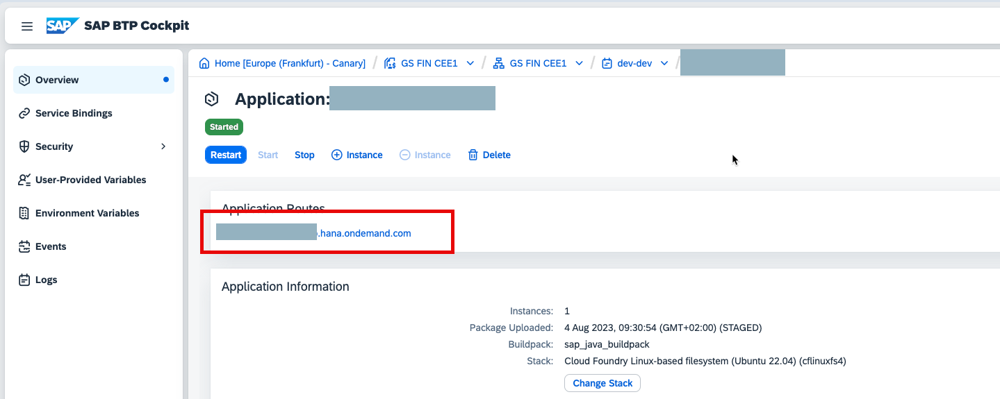
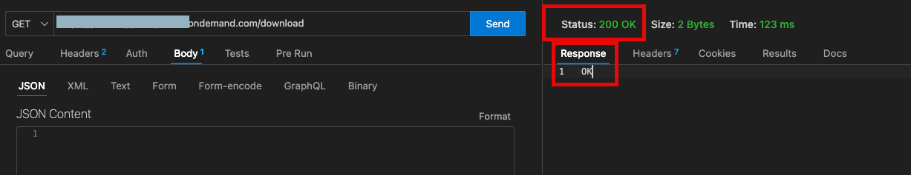
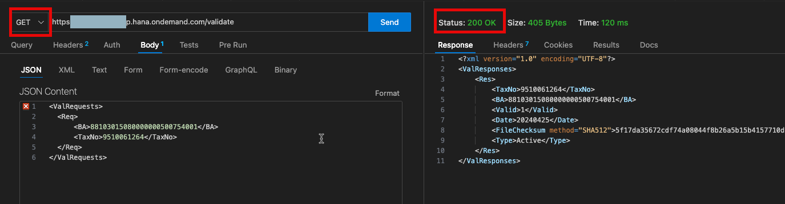

# Testing your application 
This document describes a case that tests whether the deployed application works as expected. 

1. Download and install software that allows http API testing, e.g. [Postman](https://www.postman.com/) on your computer. Alternatively you can choose another tool, some alternatives are listed e.g. [here](https://testsigma.com/blog/postman-alternatives/). 
2. You will need the URL of the application whcih can be found in the [BTP Cockpit](https://account.int.sap.eu2.hana.ondemand.com/cockpit/#/home).

3. In the API testing tool, create a GET request to the endpoint of your application. Do not set any authentification. The application exposes 2 endpoints: /validate and /download. 
4. First, create a request to download the list of VAT payers from the Polish Tax Authority. The URL of the request will be a concatenation of the URL of the app and /download. After a while, you shall receive an OK response with the http 200 status code. 

5. Create a GET request for the /validate endpoint. 
In the Body tab, provide the request for validation as shown on the picture bellow. 
You can copy+paste the following snippet 
```
<?xml version="1.0" encoding="UTF-8"?>
<ValRequests>
  <Req>
      <BA>88103015080000000500754001</BA>
      <TaxNo>9510061264</TaxNo>
  </Req>
</ValRequests>
 ```


5.	Send the request and check the response
You shall see `Status code 200 OK`
The body of the response contains information about SAP Polska. 

6. Status codes other than 200 usualy mean that there is something wrong with the deployed application. 
List of the most frequent errors: 
Communication errors are usually transformed into standard [HTTP error codes](https://www.w3schools.com/tags/ref_httpmessages.asp).

| HTTP code | Description |
| ----------- | ----------- |
| 400 | Bad request: Check the payload of the request. |
| 404 | Not found: Check the URL of your iFlow, mainly the Path Prefix. |
| 503 | Service Unavailable: Check the URL of your iFlow, mainly the Target Host. |
| 401 or 403 | Unauthorized or Forbidden: Check your authentication credentials and the URL. |
| 400 | Bad Request: Check the payload of the request body. |
| 405 | Method not allowed: Check the http request type (e.g. GET used but POST expected). |


